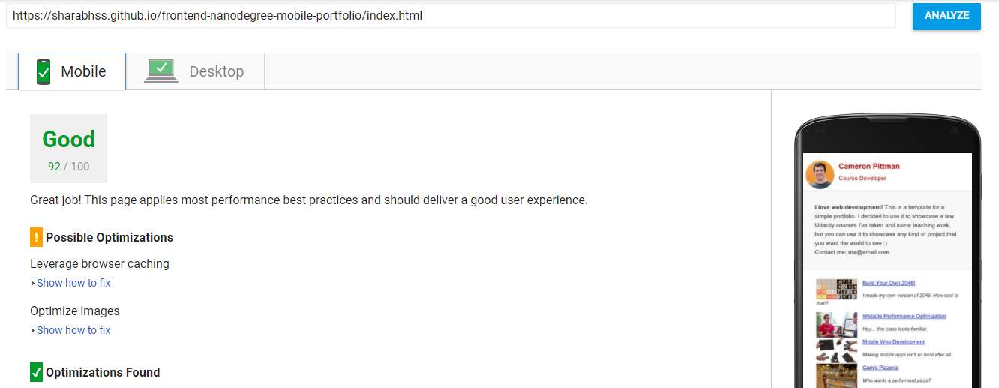
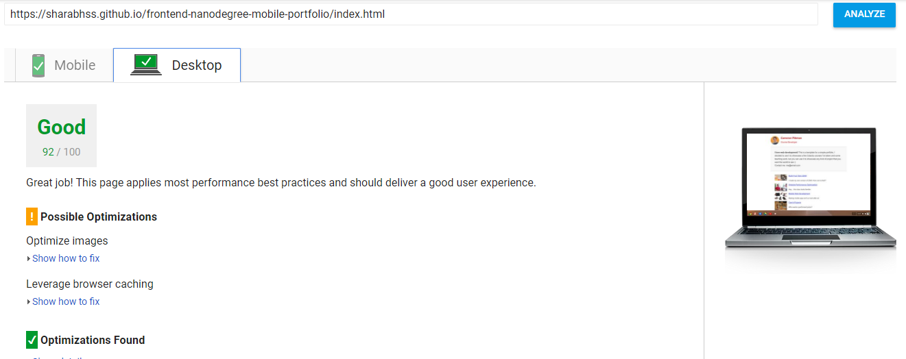
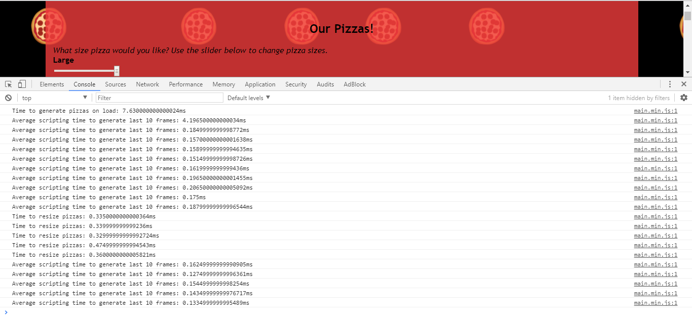

## Website Performance Optimization portfolio project

[Live Github Page](https://sharabhss.github.io/frontend-nanodegree-mobile-portfolio/)

Your challenge, if you wish to accept it (and we sure hope you will), is to optimize this online portfolio for speed! In particular, optimize the critical rendering path and make this page render as quickly as possible by applying the techniques you've picked up in the [Critical Rendering Path course](https://www.udacity.com/course/ud884).

#### Setting up and running the application

Follow the steps below to set up and run the application once the repo has been cloned or a zip has been downloaded.

* Open folder "frontend-nanodegree-mobile-portfolio-master" inside the zip or from cloned directory
* Inside, "index.html" is the main home page where PageSpeed Insights optimizations need to be made. You can edit this film using a text editor like Sublime or Atom
* For Pizza optimization, open folder "views" followed by folder "js" and inside there is a JavaScript file "main.js", which is where the changes need to be made for optimization
* To check these optimizations, open "pizza.html" from "views" folder on a web browser like Google Chrome and use its development tools to check if desired changes were made

#### Part 1: Optimize PageSpeed Insights score for index.html

After several optimization techniques applied to index.html, the PageSpeed Insights score for the page ended up being 92 on both mobile and desktop. The techniques used are described below.

Optimizations:
* Minify style.css and inline it inside index.html
* Add async load and minify js/perfmatters.js
* Add async load to Google Analytics script
* Compress each image included inside index.html

#### Part 2: Optimize Frames per Second in pizza.html

To remove jank from pizza animation in pizza.html, several optimization were made to js/main.js to achieve a desired load time and fps. Some of the steps taken were as follows:
* Use "getElementById" and "getElementsByClassName" instead of "querySelectorAll"
* Remove "determineDx" function as it was not needed and the part inside of it that was needed could be combined into the "changePizzaSizes" function
* Several variables that were initially declared inside of for loops were taken outside for faster response
* When adding pizzas to the document, made the number of pizzas added more calculated using the width of hte viewport rather than an arbitary contant that was in place initially

### Optimization Tips and Tricks
* [Optimizing Performance](https://developers.google.com/web/fundamentals/performance/ "web performance")
* [Analyzing the Critical Rendering Path](https://developers.google.com/web/fundamentals/performance/critical-rendering-path/analyzing-crp.html "analyzing crp")
* [Optimizing the Critical Rendering Path](https://developers.google.com/web/fundamentals/performance/critical-rendering-path/optimizing-critical-rendering-path.html "optimize the crp!")
* [Avoiding Rendering Blocking CSS](https://developers.google.com/web/fundamentals/performance/critical-rendering-path/render-blocking-css.html "render blocking css")
* [Optimizing JavaScript](https://developers.google.com/web/fundamentals/performance/critical-rendering-path/adding-interactivity-with-javascript.html "javascript")
* [Measuring with Navigation Timing](https://developers.google.com/web/fundamentals/performance/critical-rendering-path/measure-crp.html "nav timing api"). We didn't cover the Navigation Timing API in the first two lessons but it's an incredibly useful tool for automated page profiling. I highly recommend reading.
* <a href="https://developers.google.com/web/fundamentals/performance/optimizing-content-efficiency/eliminate-downloads.html">The fewer the downloads, the better</a>
* <a href="https://developers.google.com/web/fundamentals/performance/optimizing-content-efficiency/optimize-encoding-and-transfer.html">Reduce the size of text</a>
* <a href="https://developers.google.com/web/fundamentals/performance/optimizing-content-efficiency/image-optimization.html">Optimize images</a>
* <a href="https://developers.google.com/web/fundamentals/performance/optimizing-content-efficiency/http-caching.html">HTTP caching</a>

### Customization with Bootstrap
The portfolio was built on Twitter's <a href="http://getbootstrap.com/">Bootstrap</a> framework. All custom styles are in `dist/css/portfolio.css` in the portfolio repo.

* <a href="http://getbootstrap.com/css/">Bootstrap's CSS Classes</a>
* <a href="http://getbootstrap.com/components/">Bootstrap's Components</a>
